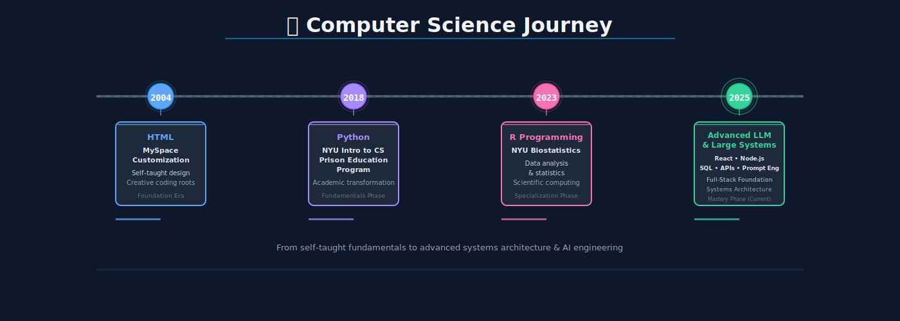

# aunray

**NYU CS · Former NY CMS Violence Interrupter · Building SafeStep — "Pedestrian Safe-Route Planning Tool"**

---

---

## 🔨 Currently Building

| Project | Description |
|---------|-------------|
| **SafeStep** | Pedestrian safety navigation — crowdsourced data + predictive routing |
| **City Patterns** | Urban development visualization across NYC & Chicago |
| **MUI Fatherhood** | Signup & management system for Man Up! Inc.'s fatherhood program |
| **MUI Calendar** | Internal scheduling app for violence intervention team coordination |
| **OneSteptoGood.com** | Personal site rebuild — intellectual OS aesthetic |
| **NYPD Misconduct RAG** | LLM-powered query system for NYC police misconduct records |
